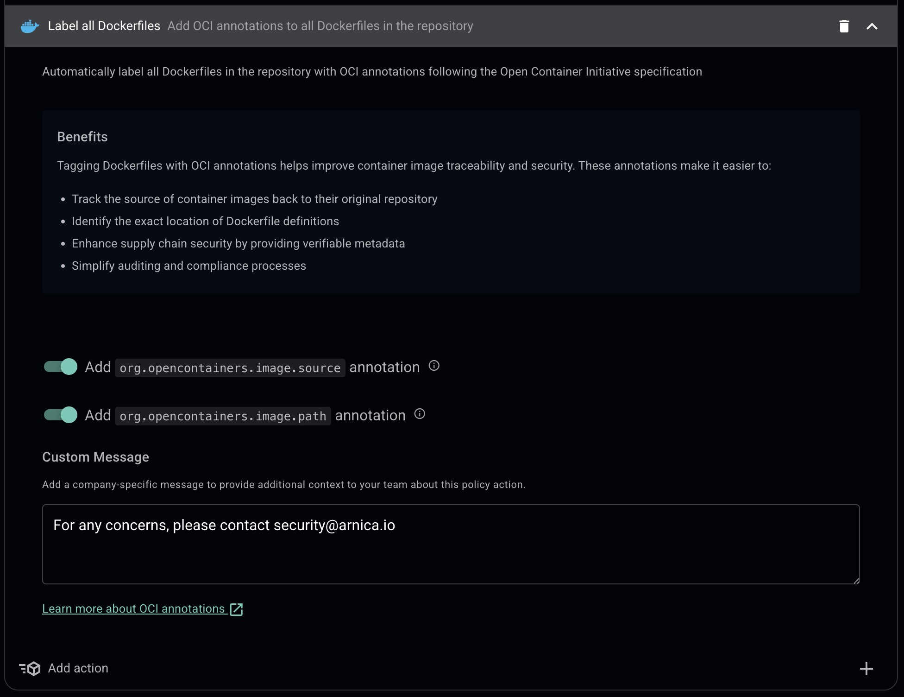

# Container Scanning 2 - Pull Request Labeling Demo

This repository demonstrates **Arnica's Pull Request policy with automated labeling** for Node.js-based containers.

## Files to Copy to Your Destination Repository

```bash
.gitignore
.github/
awsome-content.Dockerfile
package.json
package-lock.json
```

## Setup Steps

### 1. Copy Files

⚠️ **IMPORTANT**: Some files may already exist in your destination repository. Review each file before copying to avoid overwriting:
- `.gitignore` - May have existing rules
- `.github/workflows/*.yml` - May have existing workflows
- `package.json` & `package-lock.json` - May have existing dependencies

**For NEW repositories (no conflicting files):**
```bash
# Set your destination path
DEST_REPO="/path/to/destination/repo"

# Create directories if needed
mkdir -p "$DEST_REPO/.github/workflows"

# Copy files
FILES_TO_COPY=(
  ".gitignore"
  "awsome-content.Dockerfile"
  "package.json"
  "package-lock.json"
)

for file in "${FILES_TO_COPY[@]}"; do
  cp "$file" "$DEST_REPO/"
  echo "✓ Copied $file"
done

# Copy GitHub workflow files specifically (not entire directory)
for workflow in .github/workflows/*.yml .github/workflows/*.yaml; do
  [ -f "$workflow" ] && cp "$workflow" "$DEST_REPO/.github/workflows/" && echo "✓ Copied $workflow"
done
```

**For repositories with EXISTING files:**
```bash
DEST_REPO="/path/to/destination/repo"

# 1. Always safe - copy the Dockerfile
cp awsome-content.Dockerfile "$DEST_REPO/"

# 2. Review before copying (check if files exist first):
echo "Checking for conflicts..."
[ -f "$DEST_REPO/.gitignore" ] && echo "⚠️  .gitignore exists - manual merge needed"
[ -f "$DEST_REPO/package.json" ] && echo "⚠️  package.json exists - manual merge needed"
[ -d "$DEST_REPO/.github/workflows" ] && echo "⚠️  workflows exist - manual merge needed"

# 3. Manually review and merge conflicts before running the copy loop above
```

### 2. Push to Main
```bash
cd /path/to/destination/repo
git add .
git commit -m "Initial setup for Arnica PR labeling demo"
git push origin main
```

**Note:** Verify that GitHub Actions ran successfully in the Actions tab.

### 3. Integrate with Arnica
1. Log into Arnica
2. Go to **Settings** → **Integrations** → **GitHub**
3. Add this repository
4. Ensure Arnica has PR permissions
5. Wait 1-2 minutes for sync
6. Add Integration for [Container scanning](https://docs.arnica.io/arnica-documentation/getting-started/container-integrations/ghcr)

### 4. Set Up Policy (Pull Request Labeling)
1. In Arnica: **Policies** → **Create New Policy**
2. Configure:
   - **Name**: "Dockerfile PR Labeling - Node.js"
   - **Type**: Code Risk
   - **Trigger**: On Pull Request (created/updated)
   - **Scope**: Apply to `container-scanning-2` repository only
   - **Conditions**: Add file path condition for `*.Dockerfile` and `package*.json`
   - **Actions**:
     - Label all Dockerfiles
     - Enable both annotations
3. Save



### 5. Test the Policy
1. create a small PR in the repo that just changes a simple file (dosne't need to be the Dockerfile itself)
2. verify after a few seconds Arnica adds a commit with the new lables.

Create a Pull Request on GitHub and watch Arnica automatically add labels.

## Policy Type
**Code Risk policy with On Pull Request trigger** - Automatically adds labels and comments to PRs when Dockerfile or dependency files are modified.

